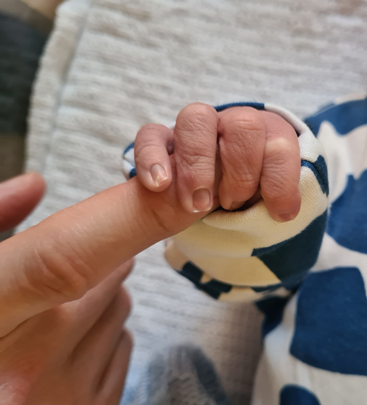

<picture>
  <source media="(prefers-color-scheme: dark)" srcset="profile_image.png">
  <source media="(prefers-color-scheme: light)" srcset="profile_image.png">
  
</picture>

# Hi there 👋

## My name is Tomasz and I would like to become a coder specialising in Python. 

### This is at least my dream for now, as I would love to change careers in my life and try something new and exciting.

#### I am very optimistic about it, but we will see how it goes...

#### 🔭 I am currently working on:

| Rank |  Not so usual things     |
|-----:|--------------------------|
|     1|Raising my boy            |
|     2|Looking after my dog      |
|     3|Completing coding bootcamp|
|     4|Working                   | 
|     5|...       run out of time |

#### 🌱 I’m currently learning:

| Rank |  Skills for life         |
|-----:|--------------------------|
|     1|How to be a father        |
|     2|Python                    |
|     3|Databases                 |
|     4|Basic HTML                | 
|     5|... anything useful       |

#### 📫 How to reach me:

[LinkedIn profile.](https://www.linkedin.com/in/tomasz-lesniewski-79774925)

#### ⚡ Fun fact:

### I can be fun you know.

#### 😄 Pronouns:

## *"You need someone to hold your hand before you start to walk."*
                                                        
**by t00mi**
<!--
**t00mi/t00mi** is a ✨ _special_ ✨ repository because its `README.md` (this file) appears on your GitHub profile.

Here are some ideas to get you started:
- 🔭 I’m currently working on ...
- 🌱 I’m currently learning ...
- 👯 I’m looking to collaborate on ...
- 🤔 I’m looking for help with ...
- 💬 Ask me about ...
- 📫 How to reach me: ...
- 😄 Pronouns: ...
- ⚡ Fun fact: ...
-->
